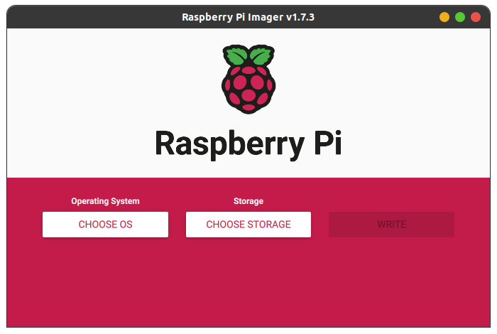
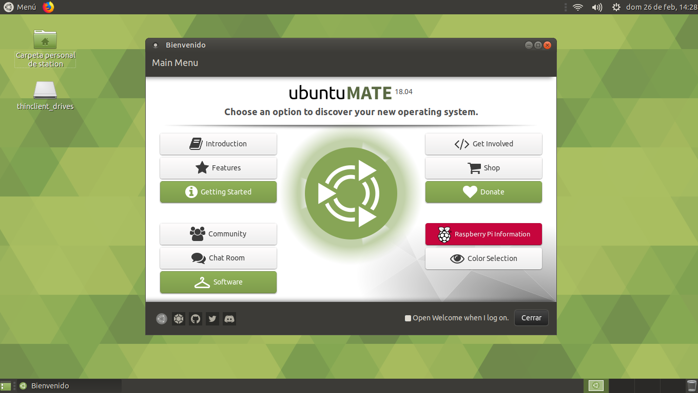
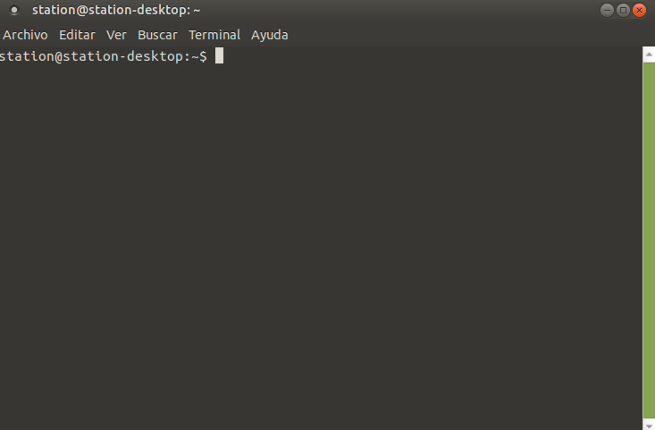

# IMPLEMENTACIÓN ROS MELODIC RASPBERRY PI 3.
- [IMPLEMENTACIÓN ROS MELODIC RASPBERRY PI 3.](#implementación-ros-melodic-raspberry-pi-3)
  - [1. INSTALACIÓN UBUNTU MATE 18.04.](#1-instalación-ubuntu-mate-1804)
  - [2. INSTALACIÓN DE ROS.](#2-instalación-de-ros)
  
La Raspberry Pi 3+ es una computadora de bajo costo. Compatible con varios sistemas operativos diferentes, lo que la hace ideal para una gran variedad de proyectos y usos. Ubuntu Mate (arquitectura armhf) es una distribución de Linux basada en Ubuntu que está diseñada específicamente para dispositivos de baja potencia como la Raspberry Pi. Al ser una distribución de Linux, Ubuntu Mate es compatible con ROS y proporciona un entorno de programación estable y confiable para la programación de robots.

Debido a las limitaciones del hardware se decidió instalar:

* Ubuntu Mate 18.04. 
* ROS Melodic Morenia (EOL: Mayo 2023). 
  
Cabe mencionar que estas versiones **no son las ultimas disponibles** , si se requiere actualizar será necesario también reemplazar la placa por la Raspberry Pi 4, la cual sin problemas soporta la versión actual (al momento de redactar este documento) de ROS (Noetic) o en su defecto ROS 2.


---
## 1. INSTALACIÓN UBUNTU MATE 18.04.
Materiales necesarios:
* Memoria SD (min. 16 GB).
* Computadora.
* Cable HDMI.
      

**1.1 Descargar la imagen de Ubuntu Mate 18.04 para Raspberry Pi:**


Dirígete al siguiente [link](https://drive.google.com/file/d/1qFFEFnqsYafqdGg73xRoJ2rVE1n13Yh0/view?usp=share_link) de Google Drive que te te va a redirigir a donde se aloja la imagen de Ubuntu Mate y descarga la imagen.

**1.2 Descargar e instalar Raspberry Pi Imager:**

Dirígete al [sitio web oficial](https://www.raspberrypi.com/software/) de Raspberry Pi y descarga Raspberry Pi Imager. Una vez que se descargue, instálalo en tu computadora.

| |
|:--:|
| <b>Fig.1 - Pantalla inicial Raspberry Imager.</b>|


**1.3 Formatear la tarjeta SD:**
Inserta la tarjeta SD en tu computadora y abre Raspberry Pi Imager. Haz clic en el botón "Choose OS" y selecciona la imagen de Ubuntu Mate 18.04 que descargaste en el paso 1.1 a continuación, haz clic en "Choose SD Card" y selecciona la letra de unidad correspondiente a la tarjeta SD. Luego, haz clic en "Write" para iniciar el proceso de escritura.

||
|:--:|
| <b> Fig. 2 - OS y Unidad de almacenamiento seleccionados. </b>|

**1.4 Configurar la Raspberry Pi:**

Después de finalizar el proceso anterior el programa te notificará cuando el proceso esté completado, inserta la tarjeta SD en la Raspberry Pi conecta la alimentación y a un monitor por medio del puerto HDMI. La Raspberry Pi debe arrancar desde la tarjeta SD y mostrar el instalador de Ubuntu Mate. Sigue las instrucciones en pantalla para completar la instalación de Ubuntu Mate en tu Raspberry Pi.

¡Y eso es todo! Con estos pasos, podrás instalar Ubuntu Mate 18.04 en tu Raspberry Pi desde Windows utilizando Raspberry Pi Imager.

--- 

## 2. INSTALACIÓN DE ROS.

Al finalizar de instalar el S.O. veremos una pantalla como la siguiente:
||
|:--:|
| <b> Fig. 3 - Pantalla de inicio Ubuntu Mate. </b>|

Simplemente cierra la pantalla, lo demás lo trabajaremos con la terminal de Ubuntu Mate. La cual puedes abrir con los siguientes pasos:

  1.  Haz clic en el botón "menú" ubicado en la esquina superior izquierda de la pantalla.

  2.  Busca la opción "Herramientas del sistema" en el menú de aplicaciones y haz clic en ella.

  3. En el submenú que aparece, busca y haz clic en "Terminal de MATE".

Esto abrirá la terminal de MATE, también puedes abrir la terminal utilizando el atajo de teclado **"Ctrl + Alt + T"**.

||
|:--:|
| <b> Fig. 4 - Terminal Ubuntu Mate. </b>|

Paso 1: Configurar el repositorio de ROS

Copia y pega o escribe el siguiente comando para configurar los repositorios de ROS en tu sistema Ubuntu (recuerda pulsar la tecla Enter ↩️ al pegar cada uno de los comandos):
```
sudo sh -c 'echo "deb http://packages.ros.org/ros/ubuntu $(lsb_release -sc) main" > /etc/apt/sources.list.d/ros-latest.list'
```
Paso 2: Configurar las claves

A continuación, configura las claves para el repositorio de ROS. Esto asegura que se descarguen paquetes de software seguros. Para hacerlo, ejecuta este comando en la terminal:
```
sudo apt-key adv --keyserver 'hkp://keyserver.ubuntu.com:80' --recv-key C1CF6E31E6BADE8868B172B4F42ED6FBAB17C654
```
Paso 3: Actualizar el sistema

Antes de instalar ROS, es importante asegurarse de que el sistema Ubuntu esté actualizado. Para actualizarlo, escribe estos comandos en la terminal:

```
sudo apt-get update
sudo apt-get upgrade
```
Paso 4: Instalar ROS Melodic.
Hay varios tipos de instalaciones por ejemplo:

* "Desktop-Full Install": Es la opción de instalación más completa de ROS Melodic, que incluye todos los paquetes disponibles en la distribución. Es adecuada para aquellos que necesitan acceso a una amplia variedad de paquetes y herramientas de ROS para su trabajo.

* "Desktop Install": Esta opción incluye los paquetes básicos necesarios para trabajar con ROS y algunos paquetes adicionales. Es una opción más ligera que la opción "Desktop-Full Install", pero aún así ofrece una buena cantidad de funcionalidad y herramientas para trabajar con ROS.

* "ROS-Base: (Bare Bones)": Esta opción es la instalación más ligera de ROS Melodic y solo incluye los paquetes esenciales necesarios para trabajar con ROS, como la comunicación básica entre nodos y la gestión de paquetes. Es adecuada si desea personalizar su instalación de ROS o si necesita una versión más liviana de ROS para un sistema con recursos limitados.

No elegiremos ROS-Base ya que requerimos de usar Rviz para depurar nuestra programación, por lo tanto, instalaremos la opción "Desktop Install" la cual incluye esta utilidad y no instalaremos la full debido a nuestros limitados recursos.

Ahora podemos instalar ROS Melodic nuestro sistema Ubuntu con el siguiente comando (esto puede tardar varios minutos):
```
sudo apt install ros-melodic-desktop
```
Paso 5: Configurar el entorno de ROS

Para utilizar ROS Melodic, es necesario configurar el entorno. Para hacerlo, escribe el siguiente comando en la terminal para agregar las variables de entorno de ROS al archivo .bashrc:
```
echo "source /opt/ros/melodic/setup.bash" >> ~/.bashrc
source ~/.bashrc
```

Paso 6: Verificar la instalación

Para verificar que ROS Melodic se ha instalado correctamente, escriba el siguiente comando en la terminal:
```
roscore
```
Si ROS se ha instalado correctamente, verás una salida semejante a la siguiente:
```
... logging to /home/your_username/.ros/log/xxxxxxxxxxxxxxxxxx/roslaunch-your_hostname-xxxx.log
Checking log directory for disk usage. This may take a while.
Press Ctrl-C to interrupt
Done checking log file disk usage. Usage is <1GB.

started roslaunch server http://your_hostname:xxxxx/

SUMMARY
========

PARAMETERS
 * /rosdistro: melodic
 * /rosversion: 1.14.9

NODES

auto-starting new master
process[master]: started with pid [xxxx]
ROS_MASTER_URI=http://your_hostname:xxxxx/

setting /run_id to xxxxxxxx-xxxx-xxxx-xxxx-xxxxxxxxxxxx
process[rosout-1]: started with pid [xxxx]
started core service [/rosout]
```
¡Listo! Ahora se ha instalado ROS Melodic en tu sistema Ubuntu 18.04.

---
